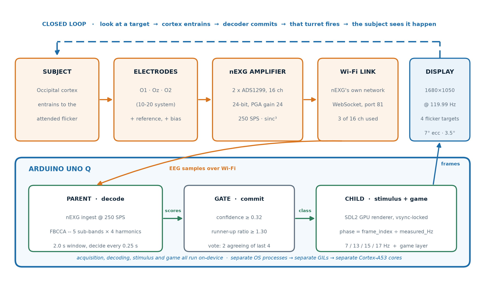
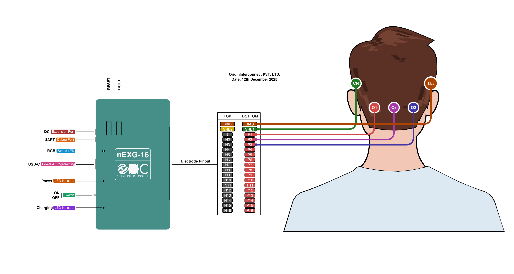
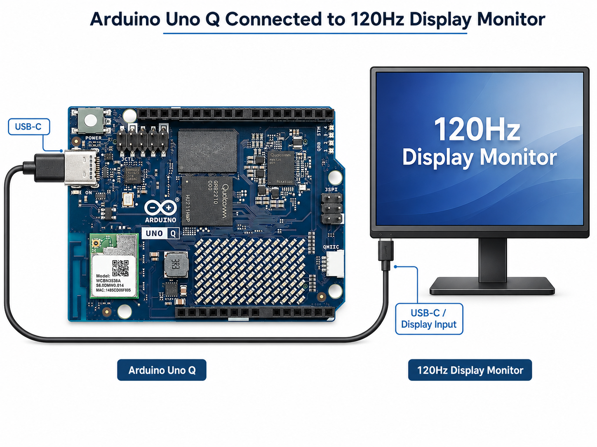
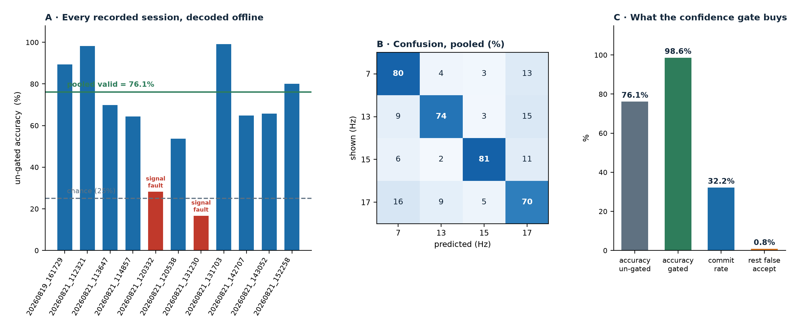

# NeuroGaze - an SSVEP brain-computer interface running entirely on an Arduino UNO Q

Look at one of four flickering squares, and the system works out which one you
chose by reading your visual cortex. No mouse, no keyboard, no muscle movement.

Everything runs **on the UNO Q itself** - EEG acquisition, signal processing,
decoding, the 120 Hz visual stimulus, and the game on top of it. There is no
host PC in the loop, no internet connection, and no cloud inference.

> Built for the Arduino Physical AI Challenge India 2026.
> This folder is the deployable version - copy it to the board and run it.



## Wiring

Five electrodes: three signal on the occipital row, one common negative above
the left ear, one reference above the right. Each goes to a specific pin on the
nEXG's BOTTOM header row, marked on the diagram below.



---

## How it works, briefly

When you stare at something that flickers at a steady rate, your visual cortex
starts oscillating at that same rate. This is a **steady-state visually evoked
potential (SSVEP)**, and you can measure it with electrodes on the back of the
head.

So: four squares flicker at 7, 13, 15 and 17 Hz. Three electrodes at O1, Oz and
O2 pick up the response, through an **nEXG** wireless amplifier. The nEXG brings
up its own Wi-Fi network; the UNO Q joins it, receives the samples, and does all
the filtering, calibration and decoding itself. Whichever of the four
frequencies shows up in your brainwaves tells us which square you were looking
at.

The decoder is **FBCCA** (Filter-Bank Canonical Correlation Analysis). It takes
the last 2 seconds of EEG, splits it into five frequency bands, and checks how
strongly each band correlates with each candidate frequency. Highest score wins
- but only if it is confident enough (see *Deciding when to answer* below).

**Nothing is trained.** There is no neural network and no model file. FBCCA
compares your EEG against plain sine and cosine waves, which is why it works
immediately on a new person with no training data.

**Where this fits Physical AI.** The whole loop - sense the EEG, decide what
the person is looking at, act on it in the game - runs standalone on the
UNO Q's on-device compute (the Qualcomm QRB2210 Linux side), with no host PC
and no cloud call anywhere in it. FBCCA is classical signal processing rather
than a trained model, on purpose: a neural network would need calibration
data from every new user before it could say anything, which defeats the
point of an assistive device that has to work the moment someone sits down.

---

## Hardware you need

| Item | Notes |
|---|---|
| Arduino UNO Q | The only compute in the project |
| nEXG wireless EEG amplifier | 16 channels, built on two ADS1299 chips. Streams over Wi-Fi via WebSocket on port 81. We use 3 of the 16. |
| 5 electrodes | O1, Oz, O2 + reference + bias |
| A **120 Hz** display | Recommended - see *Why the refresh rate matters* |
| Battery for the EEG board | Keeps the body-connected side isolated from mains |

The board has no HDMI port - the display connects over USB-C (DisplayPort
Alt-Mode), the same cable that can also power the board:



---

## Setting up

These are all the steps, starting from a UNO Q with the stock Arduino OS
desktop already booted. Run them on the board itself.

If you are working over SSH rather than at the board's own keyboard, prefix
anything that touches the screen with `export DISPLAY=:0` first, otherwise
`xrandr` and the display scripts will not find a screen.

### 1. System packages

```bash
sudo apt update
sudo apt install -y python3-pip python3-venv python3-pygame x11-xserver-utils
```

Why each one:

- **`python3-pygame`** - install it from apt, *not* pip. The apt build is
  compiled against the board's own SDL2, which is what gives a real
  vsync-locked GPU surface. Without vsync the stimulus timing is wrong and
  the decoder is correlating against a flicker the eye never saw.
- **`x11-xserver-utils`** - provides `xrandr`, which the display code reads
  to find the active screen mode.

The stock Arduino OS image already has mDNS resolution (`oric.local`) and
`liblsl` working out of the box, so on a normal install there is nothing
else to do here. Step 4 below has the two-line fix for either one, only in
case yours is missing something.

### 2. Check liblsl is there

```bash
python3 -c "import pylsl; print(pylsl.library_version())"
```

This should just print a version number. If it does, skip ahead - this is
the only thing this step is for. It only fails if `liblsl`, the native
library `pylsl` wraps, is missing, which is uncommon on the stock image:

```bash
sudo dpkg -i liblsl-*-Linux*-arm64.deb   # arm64 release from
sudo ldconfig                            # github.com/sccn/liblsl/releases
```

### 3. Python environment

```bash
python3 -m venv --system-site-packages .venv
source .venv/bin/activate
pip install -r requirements.txt
```

This is the standard venv setup, with one flag added:
`--system-site-packages` lets it use the pygame installed in step 1 instead
of downloading its own (which would lack vsync).

### 4. Join the nEXG's Wi-Fi

The amplifier brings up its own network, with no password. Easiest way: click
the network icon in the desktop taskbar, pick the nEXG's SSID from the list,
connect.

No desktop in front of you (SSH only)? Use the command line instead:

```bash
nmcli device wifi list
sudo nmcli device wifi connect "<nEXG SSID>"
```

Either way, check it actually worked:

```bash
ping -c3 oric.local
```

If that doesn't resolve, mDNS isn't working - install and start it:

```bash
sudo apt install -y avahi-daemon libnss-mdns
sudo systemctl enable --now avahi-daemon
```

### 5. Set the screen to 120 Hz

120 Hz is what this was tested against and is recommended. You can also run
at 60 Hz - the display still works, just less accurately, because the fastest
target (17 Hz) needs more frames per half-cycle than 60 Hz can give it. The
other three targets (7, 13, 15 Hz) are fine either way.

Easiest way: open the desktop's **Display Settings** and pick a 120 Hz-class
refresh rate for your monitor from there.

No desktop in front of you (SSH only)? Use the command line instead:

```bash
xrandr                       # list outputs and modes; note your output name
xrandr --output HDMI-1 --mode 1680x1050 --rate 119.99
xrandr | grep '\*'           # the * marks the mode that is actually active
```

Then turn off the desktop compositor, which adds a frame of latency and
can defeat vsync (Window Manager Tweaks > Compositor, or from the command
line):

```bash
xfconf-query -c xfwm4 -p /general/use_compositing -s false
```

### 6. Optional, but it measurably helped here

```bash
# keep the CPU off its power-saving governor
echo performance | sudo tee /sys/devices/system/cpu/cpu*/cpufreq/scaling_governor

# stop the Wi-Fi radio idling mid-stream
sudo iw dev wlan0 set power_save off
```

### 7. Tell it how far away you sit

Open `config.py` and set `VIEWING_DISTANCE_CM` to your real eye-to-screen
distance. Measure it. Every angle in the layout is derived from this
number, so if it is wrong the targets are the wrong size on your retina
and nothing will warn you.

### 8. Check it before putting electrodes on

```bash
python3 test/dryrun_no_electrodes.py   # display and game, no hardware needed
python3 test/test_display_debug.py     # flicker timing only
python3 diagnose_stream_rate.py        # is the nEXG delivering its rated rate?
```

`test/dryrun_no_electrodes.py` prints the measured present rate. It should sit
near your panel's refresh with only occasional dropped frames. If it does
not, fix that before recording anything, because a bad stimulus cannot be
recovered later.

---

## Running it

```bash
python3 run_uno_q.py            # calibration, then live detection
python3 run_uno_q.py --game     # calibration, then the zombie game
```

That is the whole interface. One command.

**What happens when you run it:**

1. It measures your screen's real refresh rate.
2. The flickering squares appear.
3. You are asked whether to skip calibration - press SPACE within 5 seconds
   to reuse saved thresholds, or wait and it calibrates.
4. Calibration takes about 90 seconds: 15 short trials. The console tells you
   which square to look at. Three of the trials ask you to look at the empty
   centre instead - this is how the system learns what "not looking at
   anything" is.
5. It prints your accuracy, then goes live. In game mode, the zombies start.

To watch performance while a real session runs, with samples/sec and frame
timing printed together every second:

```bash
python3 test/profile_full_session.py --game
```

---

## Two processes, and why that matters

This is the single most important design decision in the project, and it was
forced by a measurement rather than chosen up front.

Running the display and the decoder in one Python process **does not work on
this board**. When SDL waits for the screen's next refresh, it holds Python's
global interpreter lock for the whole ~8.3 ms, which starves the thread
receiving EEG. Measured on the UNO Q:

| | EEG samples received | Frames dropped |
|---|---|---|
| One process | 428 Hz (−57%) | 5.55% |
| **Two processes** | **1001 Hz** | **0.17%** |

So `run_uno_q.py` starts the display as a **separate operating-system process**
and talks to it over a queue. Separate processes get separate interpreter locks
and separate CPU cores, and the UNO Q has cores to spare.

This is also the answer to "why not a microcontroller?" - you need a real
multi-core OS to do this.

---

## Why the refresh rate matters

The flicker *is* the stimulus. If the screen cannot draw it accurately, there is
nothing in your brain for the decoder to find, and no amount of clever
processing recovers it.

To draw a 17 Hz square wave you need enough frames per half-cycle:

- At **120 Hz**: 3.53 frames per half-cycle. Fine.
- At **60 Hz**: 1.76 frames per half-cycle. Impossible - the target is simply
  not being displayed.

We hit exactly this. An early version of the game rendered at 62.86 Hz because
it was drawing on the CPU instead of the GPU. It *looked* like four flickering
squares, but 17 Hz was not actually being emitted and accuracy was at chance.
Moving the game to the GPU fixed it:

| | Frame rate | Time to draw a frame |
|---|---|---|
| Before | 62.86 Hz | 11.5 ms (over the 8.33 ms budget) |
| **After** | **119.8 Hz** | **0.96 ms** (11.5% of budget) |

The code also **measures** the true refresh rate at startup rather than trusting
what the system reports, because the stimulus phase is computed as
`frame_number ÷ refresh_rate`, so even a 0.3% error shifts every frequency.

---

## Deciding when to answer

A four-choice classifier that always answers is wrong 25% of the time by
guessing alone. For an assistive device, a wrong action is much worse than a
slow one.

So the decoder only commits when **all three** of these hold:

1. The winning score clears a confidence threshold.
2. It beats the runner-up by a set ratio.
3. It wins 2 of the last 4 decisions.

Otherwise it says nothing. Measured across 9 recorded sessions:

| | Accuracy | Answers given |
|---|---|---|
| Always answer | 76.1% | 100% |
| **With the gate** | **98.6%** | 32.2% |



Every calibration session saves its raw windows to disk, so the whole recorded
history can be replayed through the exact classifier the live system uses. Two of
the eleven sessions above are reported as failures rather than dropped: one
recorded 0.0 µV (electrodes not connected), the other 2,875 µV (artefact-swamped).
Both were hardware faults, not decoder faults.

It also learns a "looking at nothing" class during calibration, so looking away
produces silence rather than a random pick. False-accept rate on those windows:
**0.8%**.

---

## Files

**Run these:**

| File | What it does |
|---|---|
| `run_uno_q.py` | The single entry point. Everything starts here. |

**The pipeline:**

| File | What it does |
|---|---|
| `ads1299_stream.py` | Talks to the nEXG over Wi-Fi: connects, configures, unpacks samples. Named after the ADS1299 chips inside the nEXG. |
| `ssvep_fbcca.py` | The decoder: filtering, correlation, and the confidence gate |
| `run_ssvep_detection.py` | Calibration and the live decision loop |
| `run_ssvep_display_sdl.py` | Draws the flickering squares, locked to the screen refresh |
| `ssvep_zombie_game.py` | The game - same squares, same timing, gameplay drawn on top |
| `config.py` | Screen geometry: viewing distance, target size and spacing |
| `game_lib/ssvep_geometry.py` | Converts visual angles to pixels (correctly, per axis) |
| `game_lib/screen_utils.py` | Reads the monitor's real physical size |

**Checks and diagnostics:**

| File | What it does |
|---|---|
| `test/dryrun_no_electrodes.py` | Display and game work, without any hardware |
| `test/profile_full_session.py` | A real session, printing sample rate and frame timing every second |
| `test/ssvep_zombie_game_debug.py` | The game's frame budget in isolation |
| `test/test_display_debug.py` | Flicker timing only |
| `test/test_combined_debug.py` | Stream and display together |
| `diagnose_stream_rate.py` | Is the EEG board actually delivering its rated sample rate? |
| `sessions/visualize_sessions.py` | Plots your own calibration recordings once you have some - see below |

The `test/` scripts are **not mocks** - they import and run the real code with
logging switched on.

`run_ssvep_detection.py` saves each calibration to `sessions/*.npz` on the
board. These are not part of this repo - `sessions/*.npz` is gitignored, so a
fresh clone has none. Once you have run a calibration or two:

```bash
python3 sessions/visualize_sessions.py
```

writes per-session trace and power-spectrum plots to `sessions/plots/`, plus a
noise-trend plot across sessions once there are 2 or more.

---

## Configuring it

Edit `config.py`:

```python
VIEWING_DISTANCE_CM = 60.0   # measure this, do not guess
ECCENTRICITY_DEG    = 7.0    # how far the squares sit from the centre
STIMULUS_SIZE_DEG   = 3.5    # how big each square looks to the eye
LAYOUT              = "cross"
```

These are in **degrees of visual angle**, not pixels, so the squares are the
same real size to your eye on any screen. The geometry code converts per axis,
because pixels are not always square: at 1680×1050 on our panel, horizontal and
vertical pixel density differ by 48%. Ignoring that made a "square" target
actually 4.34° × 2.93° - below the size the method needs on one axis.

Target frequencies live in `run_ssvep_detection.py` (`FREQUENCIES`), because the
decoder builds its filters from them.

> **If you change the frequencies**, check two things: that no target sits near
> your alpha rhythm (~10 Hz), and that harmonics do not collide. A 12 Hz target
> was tried and never worked once - it sat 2.2 Hz from this subject's alpha peak.

---

## Known limitations

- **You must be able to move your eyes.** This reads where you are looking, not
  what you are thinking.
- **120 Hz is recommended.** It runs at 60 Hz too, but the 17 Hz target loses
  accuracy - see *Set the screen to 120 Hz* above.
- **Electrode contact dominates everything.** Of 11 recorded sessions, 2 were
  unusable - one flat (electrodes not connected), one swamped by artefacts.
  Both were hardware problems, not decoder problems.
- **17 Hz is the weakest target** (69.8% vs ~80% for the others). SSVEP response
  gets smaller as frequency rises.
- **About 2.25 s per decision.** A 2-second window plus two agreeing decisions.

---

## Licence

GNU General Public License v3.0. See the LICENSE file in the repository root.
